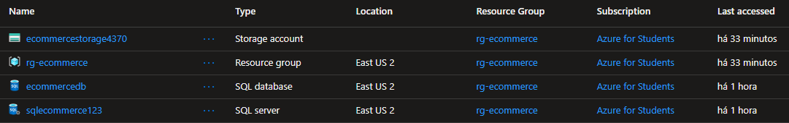
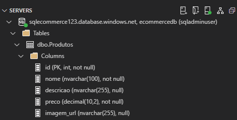
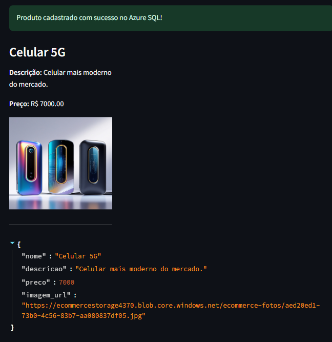
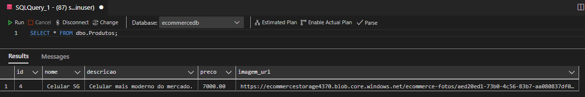
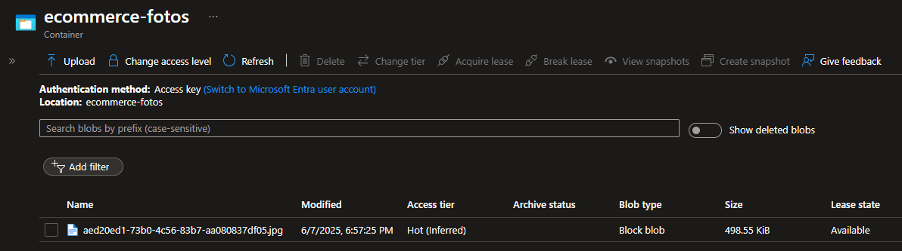

# Azure E-Commerce — Product Registration Application


A learning project that uses Terraform to provision Azure infrastructure and a Python/Streamlit web application to register and display products. Product records are stored in Azure SQL Database, and uploaded images are stored in Azure Blob Storage.

##  Overview and Architecture

The Streamlit application connects directly to Azure SQL Database using `pymssql` and uploads images using the Azure Storage SDK. It stores image URLs alongside product data and displays products in a three-column layout. It also writes a local JSON record to `produtos.json` in the current working directory, including when a database insert fails.

Terraform provisions a resource group, an Azure SQL logical server and database, and a storage account. The application runs in the environment where Streamlit is started; the repository does not provision application hosting or a serverless compute deployment.

##  Project Structure

```text
lab1-ecommerce-azure/
├── app/
│   ├── .env.example          # Configuration template; copy to .env
│   ├── .python-version      # Python 3.12
│   ├── config.py            # Shared environment loading and SQL settings
│   ├── main.py              # Streamlit application
│   ├── requirements.txt     # Validated dependency versions
│   ├── produtos.json        # Existing local sample records
│   └── database/
│       ├── init-db.py       # Python database initializer
│       ├── init-db.sh       # Wrapper for the Python initializer
│       └── init.sql         # Product table schema
├── terraform/
│   ├── main.tf
│   ├── variables.tf
│   ├── outputs.tf
│   └── deploy.sh
├── tests/
│   └── test_configuration.py
└── README.md
```

Local credentials, environment files, variable value files, and Terraform state are not part of the setup templates.

##  Tech Stack

- **Infrastructure as code:** Terraform
- **Cloud provider:** Microsoft Azure
- **Database:** Azure SQL Database on an Azure SQL logical server
- **Image storage:** Azure Blob Storage
- **Web application:** Python and Streamlit
- **Database client:** `pymssql` for both the application and database initialization
- **Configuration loading:** `python-dotenv`
- **Version control:** Git/GitHub

##  Provisioned Azure Resources

- Resource group
- Azure SQL logical server and database with the Basic SKU
- Standard storage account with locally redundant storage (LRS)
- SQL firewall rule named `AllowAzure`

The Terraform configuration does not create a Blob container. A container must exist separately for uploads to work. The SQL firewall rule allows connections from Azure services; a local client may require an additional firewall rule. The database disables zone redundancy, and the application constructs image URLs without signed access tokens. Image display depends on the container's access configuration.

##  Getting Started

### Requirements and Local Installation

- Python 3.12 (local verification used Python 3.12.3 on Linux)
- An Azure subscription with permission to create the lab resources
- Terraform installed ([download](https://www.terraform.io/downloads.html))
- Azure CLI installed and authenticated for provisioning

Run these commands from the repository root:

```bash
cd azure-fundamentals/lab1-ecommerce-azure
python3.12 -m venv .venv
source .venv/bin/activate
python -m pip install -r app/requirements.txt
python -m pip check
cp app/.env.example app/.env
```

The dependency list pins the complete set installed during phase 1. The Python initializer uses the same client as the application, so ODBC and `sqlcmd` are not required. Edit `app/.env` locally; never commit credentials.

### 1. Provision the Infrastructure

From the lab directory, run the commands below after supplying Terraform inputs. Provisioning will be completed and validated in phase 2. Provide values for `sql_server_name`, `sql_db_name`, `sql_admin`, `sql_password`, and `storage_account_name` through Terraform inputs. The declared `storage_account_name` variable is not used by the storage resource, which generates its name from `prefix` and a random suffix. The `suffix` variable is also unused.

```bash
cd terraform

# Initialize Terraform
terraform init

# Review the execution plan
terraform plan -out tfplan

# Apply the reviewed plan
terraform apply "tfplan"
cd ..
```

The configuration defaults to `eastus2`. The included deployment script loads a local environment file and prompts before applying its plan; `outputs.tf` is empty, so connection values must be obtained from the created resources.

### 2. Configure Environment Variables

Edit `app/.env` using the values for your resources. Application and initializer both use:

| Variable | Expected value |
| -------- | -------------- |
| `SQL_SERVER` | Full SQL hostname, including `.database.windows.net` |
| `SQL_DATABASE` | Database name |
| `SQL_USERNAME` | SQL login |
| `SQL_PASSWORD` | SQL password |
| `AZURE_STORAGE_CONNECTION_STRING` | Storage connection string for uploads |
| `AZURE_STORAGE_CONTAINER_NAME` | Existing Blob container name |
| `AZURE_STORAGE_ACCOUNT_NAME` | Storage account used to construct image URLs |

Both programs load `app/.env` through an absolute path derived from their source location. Process environment values take precedence. Legacy `SQL_SERVER_NAME`, `SQL_DB_NAME`, and `SQL_USER` remain accepted as fallbacks; use the canonical names above for new configurations. The legacy server name must omit the domain suffix.

### 3. Initialize the Database

With the virtual environment active, run from the lab directory:

```bash
python app/database/init-db.py
```

Alternatively, `bash app/database/init-db.sh` invokes the same initializer using `python3` from the active environment. The SQL file is resolved relative to the initializer, regardless of the working directory. A configuration or database failure returns a nonzero exit status.

The schema creates `dbo.Produtos` with `id`, `nome`, `descricao`, `preco`, and `imagem_url` columns. Run it once on a new database; repeated initialization is not yet idempotent.

### 4. Run the Application

From the lab directory, with the virtual environment active:

```bash
python -m streamlit run app/main.py
```

Open the local URL printed by Streamlit. Registration and listing require a reachable, initialized SQL database. Image uploads additionally require a configured storage account and an existing container.

## 🖥️ Application Features

- Register products with a name, description, price, and optional image
- Upload PNG and JPEG images to Azure Blob Storage
- Insert and retrieve product records in Azure SQL Database
- Display products in a three-column layout
- Check required name and description fields and enforce a nonnegative price through the Streamlit input
- Show success, warning, and error messages in the interface
- Write product data to a local JSON file

The application interface, database fields, and script messages retain their original Portuguese names.

## 🎯 Results and Demonstration

The screenshots below document the original lab results. They illustrate resource creation and product storage; they do not establish deployment timing, production readiness, restricted network access, or availability guarantees.

### 1. Infrastructure Provisioned with Terraform

<figure style="text-align: center;">
    
    <figcaption>Figure 1: Azure resources created with Terraform, including the resource group, SQL server, database, and storage account.</figcaption>
</figure>

### 2. Database Schema

<figure style="text-align: center;">
    
    <figcaption>Figure 2: Structure of the 'Produtos' table created using the database initialization script.</figcaption>
</figure>

### 3. Application Interface

<figure style="text-align: center;">
    
    <figcaption>Figure 3: Streamlit interface for registering and viewing products.</figcaption>
</figure>

### 4. Stored Data and Images

<figure style="text-align: center;">
    
    <figcaption>Figure 4: Product records stored in Azure SQL Database after registration.</figcaption>
</figure>

<figure style="text-align: center;">
    
    <figcaption>Figure 5: Product images stored in Azure Blob Storage.</figcaption>
</figure>

## Engineering Concepts Demonstrated

This lab demonstrates infrastructure as code, use of managed Azure data services, relational data persistence, and SDK integration for image uploads. Terraform provides a declarative infrastructure definition, while the application separates image storage from product metadata.

## Testing and Observability

Run the offline configuration and initializer tests from the lab directory:

```bash
python -m unittest discover -s tests -v
```

Phase 1 validates dependency installation, configuration errors, legacy variable compatibility, schema lookup from another directory, database failure exit status, and the initial Streamlit interface rendering without database operations. It does not validate live SQL connections or image uploads. No CI/CD workflow, monitoring configuration, dashboards, or health check endpoints are included. The application reports operation results through Streamlit messages.

## Improvement Phases and Validation Status

| Phase | Scope | Status |
| ----- | ----- | ------ |
| 1 | Local installation, dependency versions, shared configuration, initializer paths, and setup documentation | Locally verified on Python 3.12.3; Azure integration pending |
| 2 | Complete Terraform provisioning, connection outputs, network access, and image access | Planned |
| 3 | Consistent SQL and Blob writes, field validation, and local JSON behavior | Planned |
| 4 | Git ignore rules, generated artifacts, deployment error handling, and repeatable initialization | Planned |
| 5 | Automated checks, Azure end-to-end validation, new evidence, and resource cleanup | Planned |

For the Azure validation phase, record the subscription offer, region, resource SKUs, execution date, test outcomes, and cleanup outcome. The screenshots above are historical evidence and have not been regenerated during phase 1.

##  Maintenance and Future Improvements

- [ ] Implement user authentication
- [ ] Add product editing and deletion
- [ ] Implement product categories
- [ ] Add product search and filtering

Remaining infrastructure, data consistency, and automation improvements are tracked in the phase table above.

##  Contributing

Contributions are welcome through issues and pull requests.

##  License

This project is licensed under the MIT License. See [LICENSE](LICENSE) for details.

##  Author

**Jacivaldo Carvalho**
Telecommunications Engineer | DevOps | SRE | Networking
