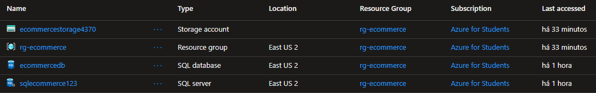
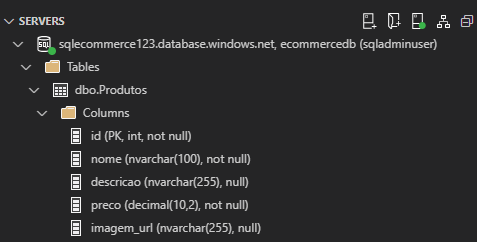
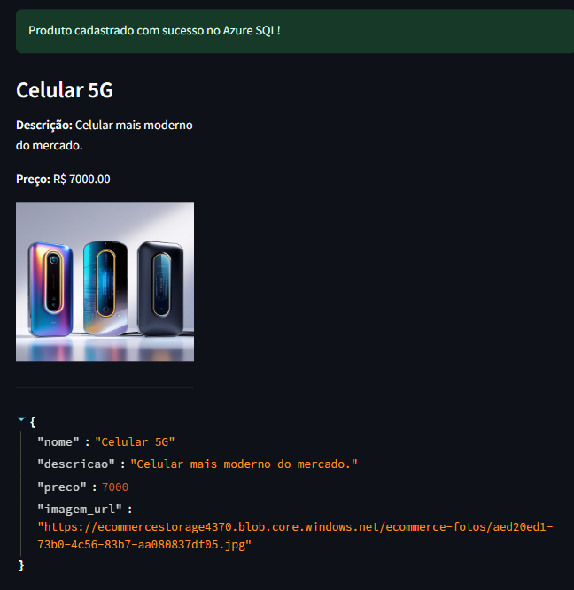
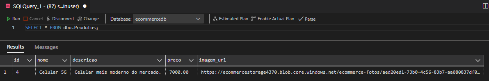
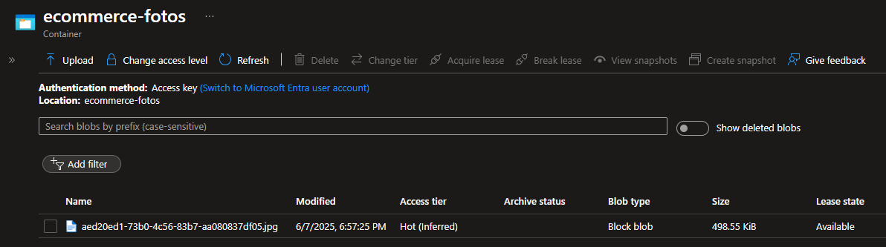

# E-commerce Azure - Sistema de Cadastro de Produtos


Solução para cadastro de produtos em um ambiente de e-commerce na nuvem Azure, utilizando infraestrutura como código com Terraform e aplicação web com Python/Streamlit.

## 📋 Visão Geral

Este projeto demonstra uma arquitetura serverless na Azure para um sistema de cadastro de produtos, incluindo:

- Provisionamento automatizado de recursos com Terraform
- Armazenamento de imagens no Azure Blob Storage
- Banco de dados relacional com Azure SQL
- Aplicação web com Python e Streamlit

## 🏗️ Estrutura do Projeto

```
lab1-ecommerce-azure/
├── app/                          # Diretório da aplicação
│   ├── main.py                   # Aplicação principal Streamlit
│   ├── database/                 # Scripts relacionados ao banco de dados
│   │   └── init_db.py            # Script de inicialização do banco
│   ├── .env                      # Variáveis de ambiente da aplicação
│   └── produtos.json             # Backup local dos produtos
├── terraform/                    # Infraestrutura como código
│   ├── main.tf                   # Configurações principais
│   ├── variables.tf              # Variáveis do Terraform
│   ├── outputs.tf                # Outputs do Terraform
│   ├── terraform.tfvars          # Valores das variáveis
│   ├── .terraform/               # Cache do Terraform
│   ├── terraform.tfstate         # Estado do Terraform
│   └── deploy.sh                 # Script de deploy automatizado
├── requirements.txt              # Dependências Python
└── README.md                     # Documentação do projeto
```

## 🛠️ Tecnologias Utilizadas

- **Infraestrutura como Código**: Terraform
- **Cloud Provider**: Microsoft Azure
- **Banco de Dados**: Azure SQL Server
- **Armazenamento**: Azure Blob Storage
- **Backend**: Python
- **Frontend**: Streamlit
- **Versionamento**: Git/GitHub

## 📦 Recursos Azure Provisionados

- Resource Group
- Azure SQL Server e Database
- Storage Account
- Blob Container

## 🚀 Como Executar o Projeto

### Pré-requisitos

- Conta Azure com permissões para criar recursos
- Terraform instalado ([download](https://www.terraform.io/downloads.html))
- Python 3.8+
- Azure CLI instalado e configurado

### 1. Provisionamento da Infraestrutura

```bash
cd terraform

# Inicializar o Terraform
terraform init

# Verificar o plano de execução
terraform plan -out tfplan

# Aplicar as configurações
terraform apply "tfplan"
```

### 2. Configurar Variáveis de Ambiente

Edite o arquivo `app/.env` com as credenciais da sua infraestrutura:

```env
# Azure Storage
AZURE_STORAGE_CONNECTION_STRING="your_connection_string"
AZURE_STORAGE_CONTAINER_NAME="your_container_name"
AZURE_STORAGE_ACCOUNT_NAME="your_account_name"

# Azure SQL
SQL_SERVER="your_server.database.windows.net"
SQL_DATABASE="your_db_name"
SQL_USERNAME="your_db_user"
SQL_PASSWORD="your_db_password"
```

### 3. Inicializar o Banco de Dados

```bash
python app/database/init_db.py
```

### 4. Executar a Aplicação

```bash
# Instalar dependências
pip install -r requirements.txt

# Executar a aplicação Streamlit
streamlit run app/main.py
```

## 🖥️ Funcionalidades da Aplicação

- Cadastro de produtos com:
  - Nome
  - Descrição
  - Preço
  - Upload de imagem
- Armazenamento de imagens no Azure Blob Storage
- Persistência de dados no Azure SQL
- Visualização dos produtos cadastrados em formato de cards

## 🎯 Resultados e Demonstração

O projeto implementado com sucesso todos os componentes necessários para um sistema de cadastro de produtos na nuvem Azure. Abaixo estão os resultados obtidos em cada etapa:

### 1. Infraestrutura Provisionada com Terraform

<figure style="text-align: center;">
    
    <figcaption>Figura 1: Recursos Azure criados automaticamente via Terraform, incluindo Resource Group, SQL Server, Database e Storage Account.</figcaption>
</figure>

✅ **Resultados alcançados**:
- Provisionamento completo da infraestrutura em menos de 5 minutos
- Configuração automatizada de todos os componentes
- Segurança implementada com regras de firewall e acesso restrito

### 2. Banco de Dados Configurado

<figure style="text-align: center;">
    
    <figcaption>Figura 2: Estrutura da tabela 'Produtos' criada automaticamente via script Python.</figcaption>
</figure>

✅ **Resultados alcançados**:
- Tabela `Produtos` criada com sucesso no Azure SQL
- Estrutura relacional otimizada para operações CRUD
- Conexão segura entre aplicação e banco de dados

### 3. Aplicação em Funcionamento

<figure style="text-align: center;">
    
    <figcaption>Figura 3: Interface intuitiva da aplicação Streamlit para cadastro e visualização de produtos.</figcaption>
</figure>

✅ **Resultados alcançados**:
- Cadastro completo de produtos com imagens
- Visualização em cards responsivos
- Validação de dados no frontend
- Feedback visual para o usuário

### 4. Dados Persistidos

<figure style="text-align: center;">
    
    <figcaption>Figura 4: Dados persistidos no Azure SQL Database após cadastro.</figcaption>
</figure>

<figure style="text-align: center;">
    
    <figcaption>Figura 5: Imagens dos produtos armazenadas com segurança no Azure Blob Storage.</figcaption>
</figure>

✅ **Resultados alcançados**:
- Dados estruturados armazenados no SQL Database
- Imagens armazenadas de forma otimizada no Blob Storage
- Links de acesso seguro às imagens
- Integração perfeita entre os componentes


## 🔧 Manutenção e Possiveis Melhorias Futuras

- [ ] Implementar autenticação de usuários
- [ ] Adicionar funcionalidade de edição/remoção de produtos
- [ ] Implementar categorias de produtos
- [ ] Adicionar busca/filtro de produtos

## 🤝 Contribuição

Contribuições são bem-vindas! Sinta-se à vontade para abrir issues ou enviar pull requests.

## 📄 Licença

Este projeto está licenciado sob a licença MIT - veja o arquivo [LICENSE](LICENSE) para detalhes.


Desenvolvido por Jacivaldo Carvalho | DevOps 